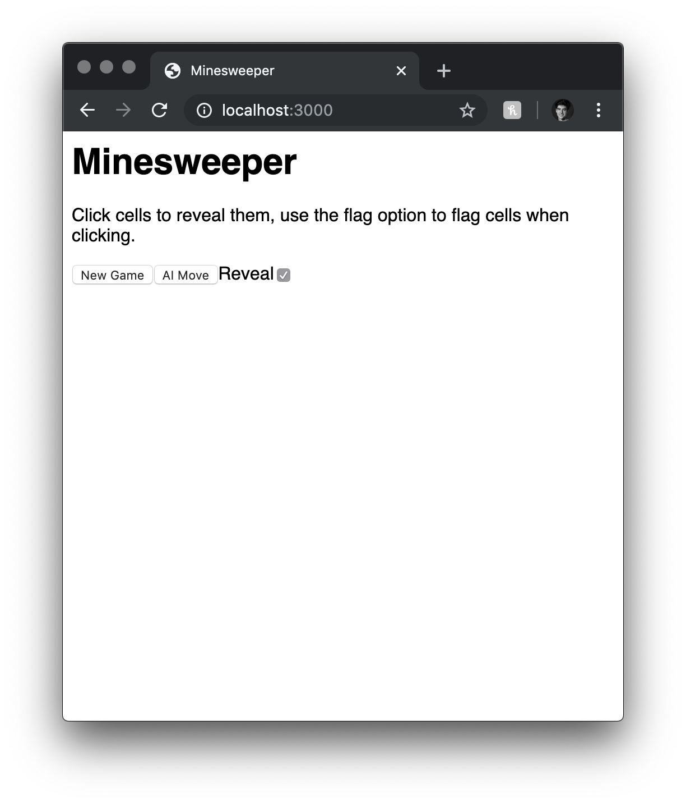
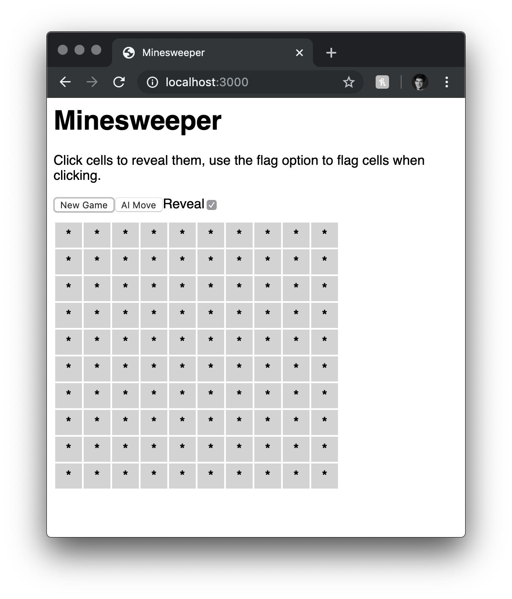
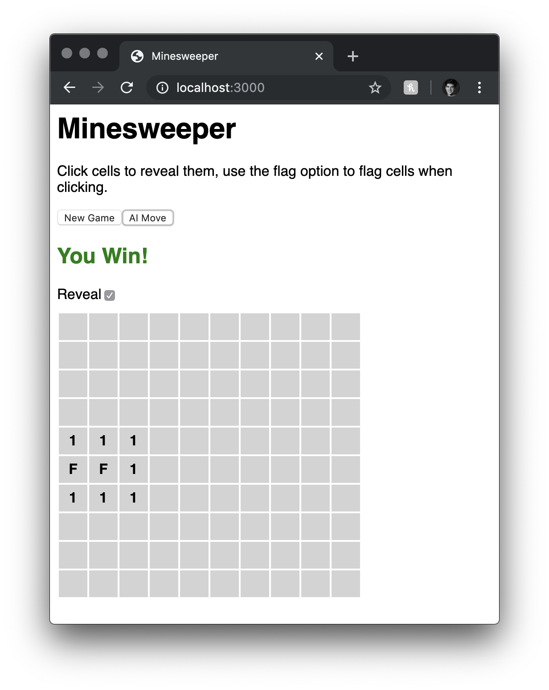
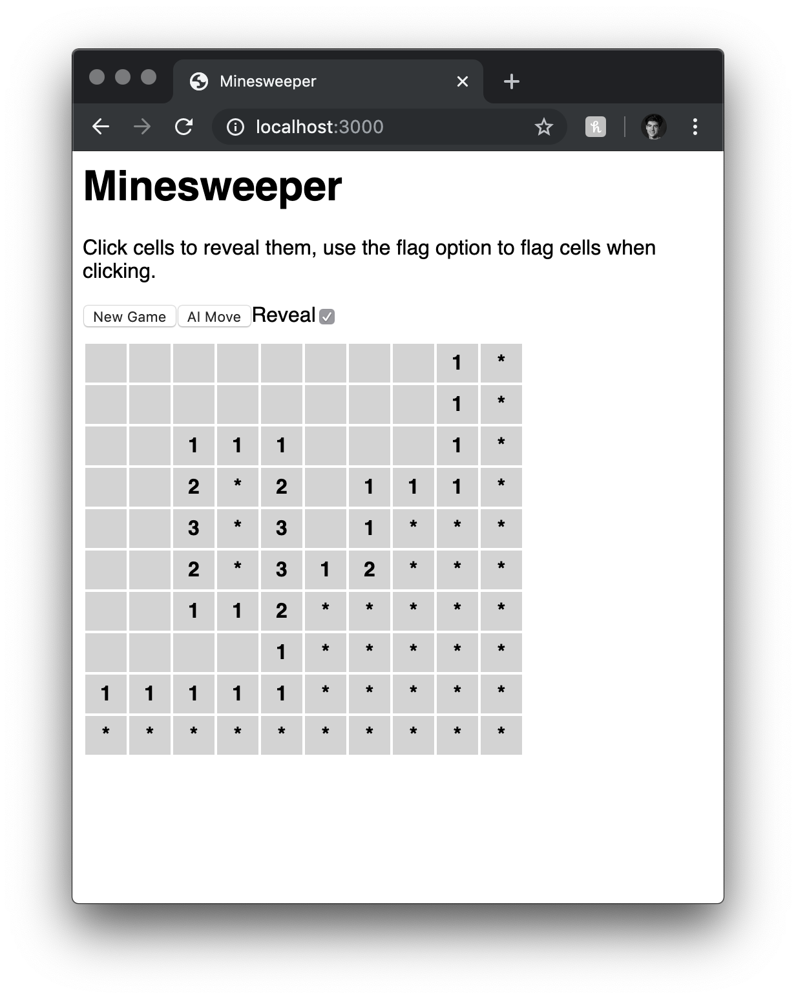
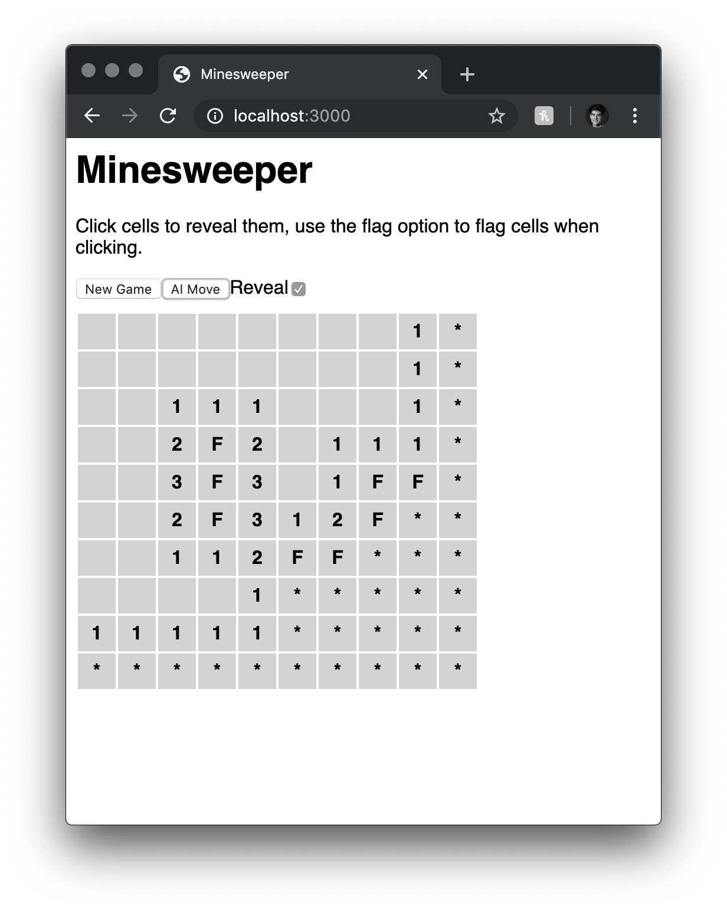
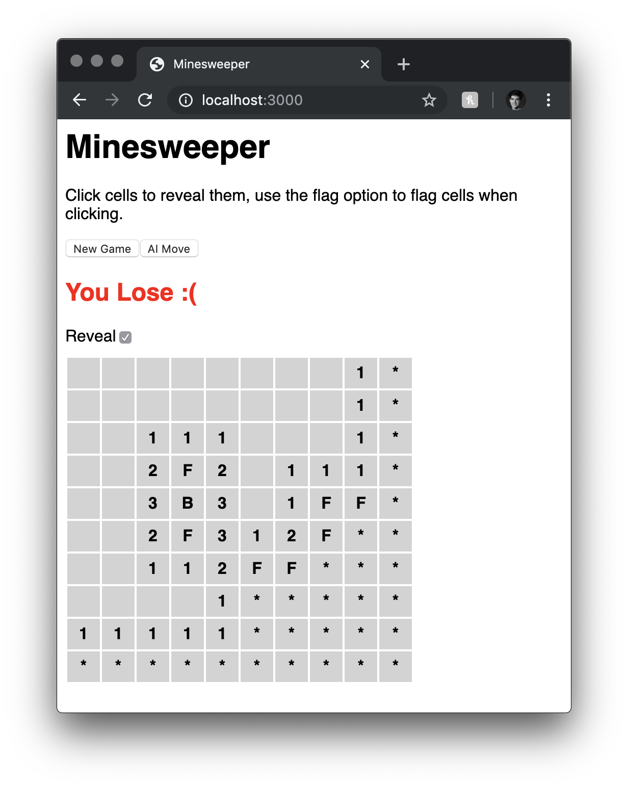

# Haskell Minesweeper

# Running the project

To run the project with stack. Simply build and then execute using the following command

`stack exec -- sweeper-exe <rows> <cols> <bombs>`

Where each option is a integer value

# The approach

The core of the game is implemented in the `Game.hs` module where the minesweeper game rule and data representation is defined. 

    type Point = (Int,Int)
    
    type Bombs = Matrix Bool
    type Solution = Matrix Int
    type Field = Matrix Char
    type Board = (Field, Solution)
    type BoardState = [(Point,Char)]

## Generating a New Game

`newGame :: Int -> Int -> Int -> StdGen -> Board`

The board is represented as tuple of matrices. Using newGame the first two arguments provide board dimension, the third to select the number of bombs on the board, and lastly a generator of random values that will be used for the creation of coordinates that contain bombs.

The Field represents the moves made on the board and is what is visualised to the user. This matrix is initialised to contain only the unknown state which is the char '*'. The state matrix will late be changed when moves are made resulting in the actions that the user makes on the board. 

The board solution is created using `genSolution :: Bombs -> Solution`. The Bombs is generated from `genBombs :: Int -> Int -> Int -> StdGen -> Bombs`, from the passed dimensions and bomb count A list of coordinates that contain bombs is generated from creating a 2D list based of the given dimensions. The the list of board Points is shuffled and based off the number of bombs passed to the function the n points are taken from the front of the shuffled list. A boolean matrix of the same dimensions is created using the list of bomb points to determine weather the element of the matrix should be true (containing a bomb) or false (contains no bomb). 

The elements of Solution created by lambda function call to `cellType :: Point -> Bombs -> Int`. The possible values range from -1:8. Bombs on the solution are represented by -1. `cellType` uses the Point value to look at the 8 adjacent cells to determine the value for that given cell in the solution. If the Point in Bombs in true (containing a bomb) then the value is set to -1. Otherwise each of the 8 surrounding cells are combined into a list and enumerated to determine the value of the cell. 

## Making a move

### Revealing

Using the Board, Point is used to change the Field of the Board to reflect a users action. `makeMove :: Point -> Bool -> Board -> Board` . The boolean represents if the action is going to be a flagging move (false) or a revealing move (true). 

If the user is attempting to reveal a at a given move. Then a set of adjacent cells on the Field will change their state to be revealed in the Field based off Solution.  This is done by using a Point to find all the adjacent points in the solution. Adjacency for a 0 cell value is all cells next to it that contain a value ≥ 0. Thus from the given point a list is recursively generated that contains Point that are adjacent. 

    findAdj :: [Point] -> [Point] -> Solution -> [Point]
    findAdj [] found sol = found
    findAdj (x:xs) found sol = findAdj xs' found' sol
                            where 
                                found' = (x:found)
                                xss = (getRegion x sol) `union` xs
                                xs' = (xss \\ found')

`getRegion :: Point -> Solution -> [Point]` finds the adjacent cells to a given point in the solution if it 0 adjacency cell.

From the list of Points that should now be revealed the Field is recursively updated from the list of points to contain a state based on the Solution.

- 0:8 for a board cell that contains a adjacency value
- B for a bomb cell

### Flagging

Flagging will simply change the Field at a given point to that of a state char that represents a flag 'F'

## Winning

The win condition is check simply by determining that the all the Solution Cells that contain -1 (are bombs) are 'F' in the Field (are flagged)

## Losing

Losing is determined after each move if a Bomb has been Revealed

# Solver

`Solver.hs` contains the methods that describe the AI move. The solution given allows for the deterministic flagging and revealing based of the board state. The current solution does not employ guessing by rather uses a Single Point Strategy.

    type Move = (Point,Bool)
    type PossibleMoves = [Move]

`aiMove :: Board -> Possible Moves` uses the given Board which does contain the state and solution, but only uses the state to generate a list of possible moves that are stored in a priority queue based on game impact. Moves that flag bombs are treated with greater priority as they get to a win state, where revealing moves only give more information.

In the game when a AI move is made the call to `aiMove` will be done in a loop until the list of possible moves is empty. Meaning that the AI can not determine another move to be made. 

The approach is based on the suggested algorithm described in the following paper

In cases where a possible move cannot be made the Board remains unchanged.

# User Interface

The main handling of the user interaction is outline in `main.hs`. Here scotty was used to serve a html document that was generated using blaze. The html page uses javascript to render the board and handle the requests made to the scotty server based of the interaction given. 

    main :: IO ()
    main = do
        (r, c, b) <- getRecord "Example Program"
        scotty 3000 $ do
            get "/" $ do
                html $ page
            get "/new" $ do
                seed <- liftIO newStdGen
                let board = newGame r c b seed
                newGameBoard board
            post "/" $ do
                x <- jsonData
                move x
            post "/ai" $ do
                x <- jsonData
                ai x

Here the for main operations for the game are described. The request for the ui which is done from a get request to "/". This will send back a html document that is created with blaze. A get request "/new" requests a randomly generated board to be created. This data is then serialised to JSON using the data types defined below which give a instance for the aeson package.

    data GameState = GameState {
        state :: [[Char]],
        sol :: [[Int]],
        isWon :: Bool,
        isLost :: Bool
    } deriving (Generic, Show)
    
    instance ToJSON GameState where
        toEncoding = genericToEncoding defaultOptions
    instance FromJSON GameState
    
    data MoveFromState = MoveFromState {
        mvState :: [[Char]],
        mvSol :: [[Int]],
        x :: Int,
        y :: Int,
        mvType :: Bool
    } deriving (Generic, Show)
    instance ToJSON MoveFromState where
        toEncoding = genericToEncoding defaultOptions
    instance FromJSON MoveFromState

These data types describe the information that is sent to the client from the server. GameState is what is always sent to the user, this describes the resulting/starting state of the game. MoveFromState describes a move on a given state. That move can either be a user revealing or flagging a cell on the Field, or it could be a AI move on the given state. `move :: MoveFromState -> ActionM()`, `ai :: MoveFromState -> ActionM()`

# Examples of Working Implementation

Initialised game with no Board 

A request made for a new game

A move in the top left corner revealed all but surrounding for a board with one bomb in it.

The result of a deterministic AI move

Reveal on a 10x10 board that contains 10 bombs, move was made in the top left corner

AI makes attempted moves on a complex board

The revealing of a bomb cause you to lose the game.
